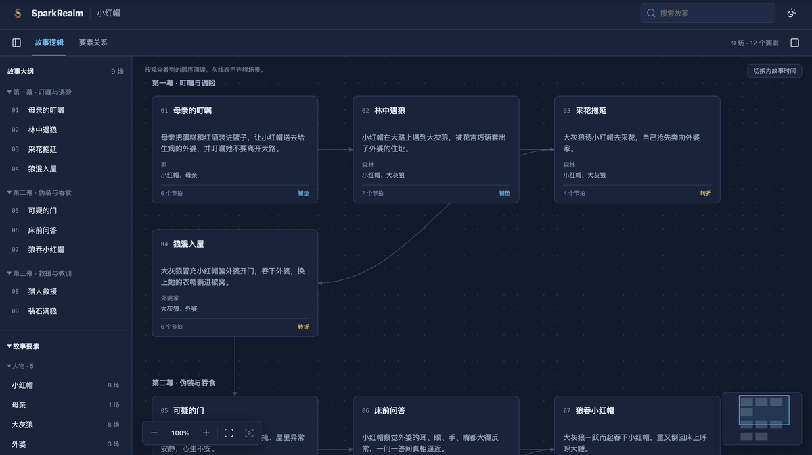
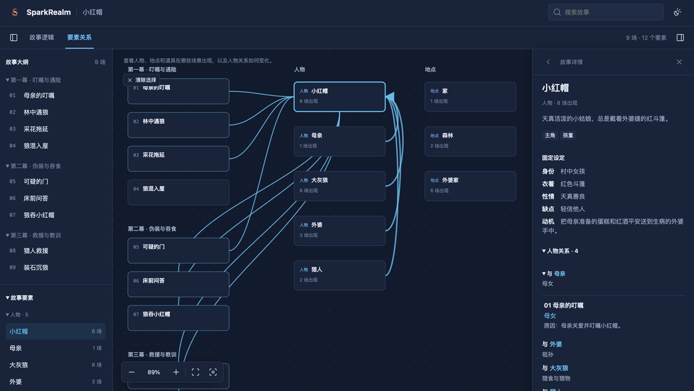

<p align="center"></p>

<p align="center"><b>English</b> · <a href="README.md">简体中文</a></p>

# SparkRealm

> *A single spark can start a prairie fire.*

SparkRealm is a growing (in-development) AIGC creative assistant.<br>
Its goal is to help more people express and create freely, turning sparks of inspiration into moving works.<br>
SparkRealm is at an early stage — feedback and suggestions are welcome.

## Features

### Story organization

Turn scattered ideas or a script into a clear, explorable story structure.

1. **Element extraction** Parse the characters, locations, and props, mark which scenes they appear in, and how their states change as the story develops.
2. **Storyline organization** Organize the plot by acts and scenes, sorting out sequence, causality, and setups, shown in two views: "Story time" and "Telling order".
3. **Character relationships** Track how relationships between characters change as the story develops.
4. **Visualization** Browse as a graph; click for details and beats; zoom, search, and locate via the minimap.

**[▶ Open the interactive demo](https://winniewang-ai.github.io/spark_realm/)**

| Story logic | Element relations |
| --- | --- |
| [](https://winniewang-ai.github.io/spark_realm/little_red.en.html) | [](https://winniewang-ai.github.io/spark_realm/little_red.en.html) |

> **TODO · Interactive editing in the UI** Let users edit the story directly in the graph — modify scenes/characters, add/remove/adjust relations, drag the layout (currently edits go through chat and the agent).

## Install, then describe your idea

```bash
npx skills add WinnieWang-AI/spark_realm -g
```

Send this to your agent:

```text
Use the storygraph skill to write a short story about …, and confirm the characters and scenes with me first.
```

The agent will organize the story logic and generate an interactive graph.

### More installation options

Install explicitly to a specific host:

```bash
npx -y skills add WinnieWang-AI/spark_realm --skill storygraph --agent opencode --global --copy --yes
```

Try without installing:

```bash
npx skills use WinnieWang-AI/spark_realm --skill storygraph --agent opencode
```

Or point directly at the Skill subdirectory in the repo:

```bash
npx skills add https://github.com/WinnieWang-AI/spark_realm/tree/main/.agents/skills/storygraph -g
```

`npx skills` auto-detects installed hosts (OpenCode, Codex, Claude Code, …) and writes to their skills directories. Node.js is required.
